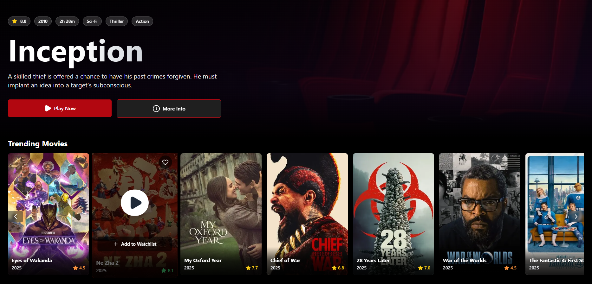

# Movie Streaming Platform

A modern, responsive movie streaming platform built with Next.js and TMDB API. Features include horizontal scrolling, smooth animations, and a rich user interface.

[](https://rockstreamer-task.vercel.app/)

## 🚀 Features

- ⚡ **Fast Performance** - Built with Next.js 15 and React
- 📱 **Responsive Design** - Fully responsive on all devices
- 🎨 **Modern UI** - Sleek design with smooth animations
- 🔄 **Dynamic Loading** - Infinite scroll and pagination
- 🎬 **TMDB Integration** - Real movie data from TMDB API
- 🎯 **SEO Optimized** - Built with SEO best practices

## 🛠️ Tech Stack

- [Next.js 15](https://nextjs.org/) - React Framework
- [Tailwind CSS](https://tailwindcss.com/) - Styling
- [TMDB API](https://www.themoviedb.org/documentation/api) - Movie Data
- [Luicide React Icons](https://lucide.dev/icons/) - Icons
- [Class Variance Authority](https://cva.style/docs) - Component Variants

## 📦 Installation

1. **Clone the repository:**

   ```bash
   git clone https://github.com/chayandasgupta/rockstreamer-frontend-task.git
   cd rockstreamer-frontend-task
   ```

2. **Install dependencies:**

   ```bash
   npm install
   ```

3. **Environment Setup:**
   - Copy the `.env.example` file to `.env`:
     ```bash
     cp .env.example .env
     ```
   - Get your TMDB API key from [TMDB Website](https://www.themoviedb.org/settings/api)
   - Update `.env` with your TMDB credentials:
     ```env
     NEXT_PUBLIC_TMDB_API_KEY=your_api_key_here
     ```

## 🚀 Running the Project

1. **Development Mode:**

   ```bash
   npm run dev
   # or
   yarn dev
   # or
   pnpm dev
   ```

   Open [http://localhost:3000](http://localhost:3000) in your browser.

2. **Production Build:**
   ```bash
   npm run build
   npm start
   ```

## 📁 Project Structure

```
my-app/
├── app/                  # Next.js 15 app directory
├── components/           # React components
│   ├── hero/            # Hero section components
│   ├── movie/           # Movie related components
│   └── ui/              # UI components
├── config/              # Configuration files
├── lib/                 # Utility functions
├── public/              # Static assets
```

## 🎨 Key Features

### Responsive Design

- Mobile-first approach
- Fluid typography and spacing

### Horizontal Pagination

- Smooth scrolling
- Touch-friendly
- Dynamic loading
- Scroll controls

### Hover Animations

- Smooth transitions
- Scale effects
- Content reveal
- Background overlays

## 🔧 Configuration

### TMDB API Configuration

The project requires TMDB API credentials:

1. Create an account on [TMDB](https://www.themoviedb.org/)
2. Get your API key from [API Settings](https://www.themoviedb.org/settings/api)
3. Update your `.env` file with the credentials

## 📝 Development Guidelines

1. **Component Structure:**

   - Use functional components

2. **Styling:**
   - Use Tailwind CSS classes
   - Follow mobile-first approach
